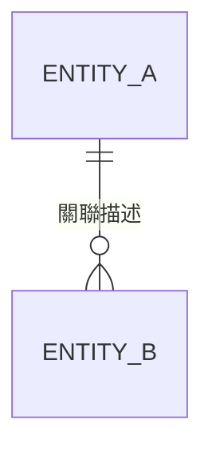

# Models（資料模型文件）Skill

## 描述

此技能用於生成資料模型設計文件（Data Model Document）。當使用者要求定義或撰寫資料模型時，AI Agent 應依照以下結構產出完整的資料模型設計文件。

## 觸發條件

當使用者提出以下類型的請求時啟用此技能：
- 「/models」
- 「幫我寫資料模型」
- 「產生資料模型設計」
- 「建立 Models 文件」
- 「定義資料結構」

## 輸出格式

請依照以下模板撰寫資料模型文件：

### 1. 概述（Overview）
- **專案名稱**：[名稱]
- **版本**：[版本號]
- **日期**：[撰寫日期]
- **作者**：[作者名稱]
- **文件目的**：描述此資料模型文件的目的與適用範圍
- **使用框架**：所使用的 ORM / ODM 框架（如 Django ORM、SQLAlchemy、Pydantic、Tortoise ORM 等）

### 2. 資料庫選型（Database Selection）
| 項目 | 說明 |
|------|------|
| **資料庫類型** | 關聯式（SQL）/ 非關聯式（NoSQL）/ 混合 |
| **資料庫引擎** | PostgreSQL / MySQL / MongoDB / SQLite 等 |
| **選擇原因** | 為什麼選用此資料庫 |
| **版本** | 資料庫版本號 |

### 3. 資料實體定義（Data Entities）
針對每個資料實體（Model）撰寫以下內容：

#### 3.1 [實體名稱]（Entity Name）
- **描述**：此實體的用途與職責
- **對應資料表名稱**：[資料表名稱]

##### 欄位定義（Field Definitions）
| 欄位名稱 | 資料類型 | 必填 | 預設值 | 說明 |
|----------|----------|------|--------|------|
| id | Integer / UUID | 是 | 自動產生 | 主鍵 |
| [欄位名] | [類型] | [是/否] | [預設值] | [說明] |

##### 索引（Indexes）
| 索引名稱 | 欄位 | 類型 | 說明 |
|----------|------|------|------|
| [索引名] | [欄位] | UNIQUE / INDEX / COMPOSITE | [說明] |

##### 範例程式碼（Example Code）
```python
# 提供該 Model 的 Python 程式碼範例
```

### 4. 關聯關係（Relationships）
描述各資料實體之間的關聯關係：

| 來源實體 | 關聯類型 | 目標實體 | 外鍵欄位 | 說明 |
|----------|----------|----------|----------|------|
| [實體A] | 一對一 / 一對多 / 多對多 | [實體B] | [外鍵欄位名] | [說明] |

#### ER Diagram（實體關係圖）
使用 Mermaid 語法繪製 ER 圖：


### 5. 欄位驗證規則（Validation Rules）
針對需要驗證的欄位，說明驗證規則：

| 實體 | 欄位名稱 | 驗證規則 | 錯誤訊息 |
|------|----------|----------|----------|
| [實體名] | [欄位名] | 必填 / 長度限制 / 格式驗證 / 範圍限制 | [自訂錯誤訊息] |

### 6. 資料序列化與轉換（Serialization & Transformation）
- **序列化格式**：JSON / XML / 其他
- **序列化欄位**：哪些欄位需要對外暴露
- **隱藏欄位**：哪些欄位不應出現在 API 回應中（如密碼）
- **計算欄位**：需要動態計算的虛擬欄位
- **自訂轉換邏輯**：特殊的資料轉換需求

### 7. 查詢方法（Query Methods）
針對常用的查詢需求，定義自訂查詢方法：

| 方法名稱 | 參數 | 回傳值 | 說明 |
|----------|------|--------|------|
| [方法名] | [參數列表] | [回傳類型] | [用途說明] |

##### 範例程式碼
```python
# 提供自訂查詢方法的程式碼範例
```

### 8. 資料遷移策略（Migration Strategy）
- **遷移工具**：Alembic / Django Migrations / 其他
- **版本控制**：遷移檔案的管理方式
- **向下相容**：確保遷移可回滾
- **資料填充（Seeding）**：初始資料的載入策略

### 9. 商業邏輯（Business Logic）
定義嵌入在 Model 層的商業邏輯：
- **生命週期鉤子（Lifecycle Hooks）**：
  - `before_create` / `after_create`
  - `before_update` / `after_update`
  - `before_delete` / `after_delete`
- **自訂方法**：封裝在 Model 內的商業邏輯方法
- **屬性（Properties）**：透過 `@property` 裝飾器定義的計算屬性

### 10. 安全考量（Security Considerations）
- **敏感資料處理**：密碼雜湊、個資加密等
- **存取控制**：哪些角色可存取哪些 Model 或欄位
- **審計日誌（Audit Log）**：記錄資料的建立、修改、刪除操作
- **軟刪除（Soft Delete）**：是否採用軟刪除機制

### 11. 效能考量（Performance Considerations）
- **快取策略**：哪些查詢需要快取、快取失效策略
- **延遲載入（Lazy Loading）vs 預載入（Eager Loading）**：關聯資料的載入策略
- **分頁策略**：大量資料的分頁處理方式
- **資料庫連線池**：連線池配置建議

## 注意事項

- 所有資料模型文件內容應以**繁體中文**撰寫
- ER 圖建議使用 **Mermaid** 語法，方便直接在 Markdown 中呈現
- 每個欄位的描述應清晰明確，包含**資料類型**與**用途說明**
- 敏感欄位（如密碼、Token）必須標註**安全處理方式**
- Model 命名應遵循**專案命名慣例**（如 PascalCase）
- 若有尚未確定的設計決策，應標註為「待確認」
- 文件應保持**活文件（Living Document）**的精神，隨專案演進持續更新
