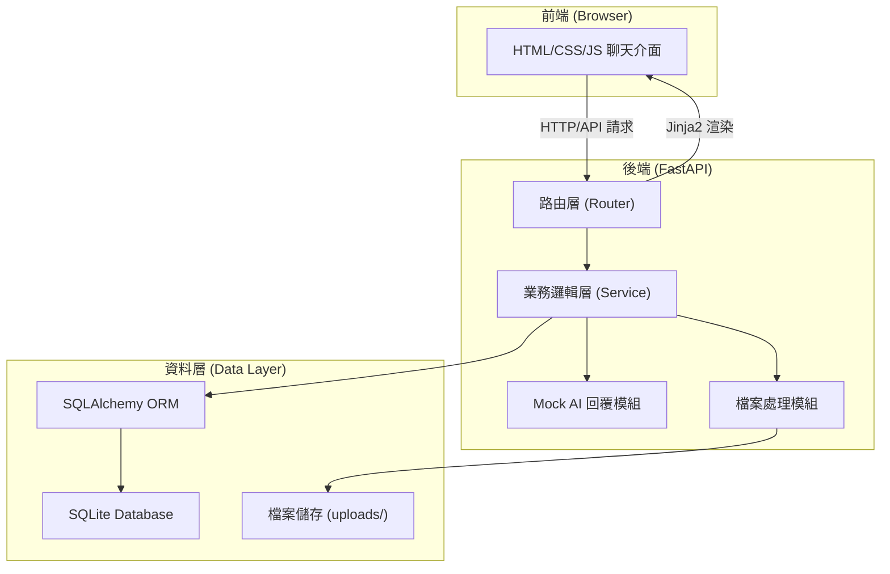

# 軟體架構文件（Architecture Document）

### 1. 概述（Overview）
- **系統名稱**：智慧聊天機器人（Smart Chatbot）
- **版本**：1.0.0
- **日期**：2026-04-22
- **作者**：Antigravity
- **文件目的**：描述智慧聊天機器人的系統架構設計，包含元件設計、資料架構、API 設計與部署策略，作為開發團隊的技術指引。

### 2. 架構目標與約束（Goals & Constraints）
- **設計原則**：
  - 單一職責原則（SRP）：每個模組只負責一項功能
  - 鬆耦合：AI 回覆模組抽象化，便於替換 Mock 為真實 API
  - 高內聚：相關功能集中在同一模組中
- **技術限制**：
  - 使用 SQLite 作為資料庫（單檔案嵌入式，不支援高併發）
  - 前端不使用 SPA 框架，以 Jinja2 模板 + Vanilla JS 實作
  - AI 回覆以 Mock 方式模擬
- **假設與前提**：
  - 系統為單使用者或少量使用者使用
  - 部署於本機開發環境

### 3. 系統架構圖（System Architecture Diagram）

### 4. 元件設計（Component Design）

#### 4.1 路由層（Router）
- **職責**：接收 HTTP 請求，分發至對應的業務邏輯
- **介面**：
  - 頁面路由：`GET /` 首頁渲染
  - Session API：`POST/GET/PUT/DELETE /api/sessions`
  - Message API：`POST/GET /api/sessions/{id}/messages`
  - File API：`POST /api/upload`
  - Memory API：`GET/PUT /api/memory`
- **技術選型**：FastAPI Router

#### 4.2 業務邏輯層（Service）
- **職責**：處理核心業務邏輯，包含聊天室管理、訊息處理、記憶機制
- **依賴關係**：依賴 ORM 層存取資料、依賴 Mock AI 模組產生回覆
- **技術選型**：Python 函式模組

#### 4.3 Mock AI 回覆模組
- **職責**：模擬 AI 回覆，回傳預設或隨機回應
- **介面**：`generate_reply(messages: list, memory: dict) -> str`
- **技術選型**：Python（預留替換為 Google Gemini / OpenAI API 的介面）

#### 4.4 檔案處理模組
- **職責**：處理檔案上傳、驗證與儲存
- **介面**：`upload_file(file: UploadFile) -> Attachment`
- **技術選型**：FastAPI UploadFile + aiofiles

### 5. 資料架構（Data Architecture）
- **資料模型**：Session、Message、Attachment、Memory（詳見 Models 文件）
- **資料庫設計**：SQLite 單檔案資料庫，透過 SQLAlchemy ORM 操作
- **資料流**：
  1. 使用者發送訊息 → 建立 Message 記錄（role=user）
  2. 系統呼叫 Mock AI → 建立 Message 記錄（role=assistant）
  3. 訊息關聯至對應的 Session
- **資料儲存策略**：
  - 對話資料：SQLite 持久化
  - 上傳檔案：`uploads/` 資料夾儲存

### 6. API 設計（API Design）

#### 對外 API

| 端點 | 方法 | 說明 | 請求格式 | 回應格式 |
|------|------|------|----------|----------|
| `/` | GET | 首頁渲染 | - | HTML |
| `/api/sessions` | GET | 取得所有聊天室 | - | JSON Array |
| `/api/sessions` | POST | 建立新聊天室 | `{"title": "..."}` | JSON |
| `/api/sessions/{id}` | GET | 取得聊天室詳情與訊息 | - | JSON |
| `/api/sessions/{id}` | PUT | 更新聊天室標題 | `{"title": "..."}` | JSON |
| `/api/sessions/{id}` | DELETE | 刪除聊天室 | - | JSON |
| `/api/sessions/{id}/messages` | POST | 發送訊息（含 AI 回覆） | `{"content": "..."}` | JSON |
| `/api/sessions/{id}/regenerate` | POST | 重新生成最後一則 AI 回覆 | - | JSON |
| `/api/upload` | POST | 上傳檔案 | multipart/form-data | JSON |
| `/api/memory` | GET | 取得使用者記憶 | - | JSON |
| `/api/memory` | PUT | 更新使用者記憶 | `{"key": "...", "value": "..."}` | JSON |

### 7. 技術堆疊（Technology Stack）

| 層級 | 技術選擇 | 說明 |
|------|----------|------|
| 前端 | HTML + CSS + JavaScript | 使用 Jinja2 模板引擎，Vanilla JS 處理互動 |
| 後端 | FastAPI | Python 非同步 Web 框架，高效能、自動 API 文件 |
| 資料庫 | SQLite + SQLAlchemy | 輕量級嵌入式資料庫，ORM 抽象化操作 |
| AI 模組 | Mock（Python） | 模擬回覆，預留真實 API 介面 |
| 檔案儲存 | 本機檔案系統 | 上傳檔案存於 `uploads/` 資料夾 |

### 8. 部署架構（Deployment Architecture）
- **部署環境**：本機開發環境
- **啟動方式**：`python app.py`（Uvicorn 內建啟動）
- **存取網址**：`http://127.0.0.1:8000`
- **資料庫檔案**：`database.db`（首次執行自動建立）
- **上傳目錄**：`uploads/`（首次上傳自動建立）

### 9. 安全架構（Security Architecture）
- **輸入驗證**：所有使用者輸入透過 Pydantic Schema 驗證
- **檔案上傳安全**：
  - 驗證檔案副檔名（白名單機制）
  - 限制檔案大小（最大 10MB）
  - 使用 UUID 重新命名檔案，防止路徑遍歷攻擊
- **XSS 防護**：Jinja2 預設自動跳脫 HTML 特殊字元
- **SQL Injection 防護**：使用 SQLAlchemy ORM 參數化查詢

### 10. 非功能需求實現（NFR Implementation）
- **效能**：SQLite 查詢加上索引，頁面載入 < 2 秒
- **可擴展性**：AI 回覆模組抽象化，可替換為任意 AI API
- **可維護性**：程式碼遵循 PEP 8 規範，關鍵函式附中文註解

### 11. 架構決策紀錄（Architecture Decision Records, ADR）

#### ADR-001：使用 Mock 而非真實 AI API
- **背景**：專案初期需要快速驗證前端互動與後端架構
- **選項分析**：
  - 方案 A：直接串接 Gemini API — 需要 API Key，增加開發門檻
  - 方案 B：使用 Mock 模擬 — 無外部依賴，可離線開發
- **最終決策**：選擇方案 B，使用 Mock 模擬回覆
- **影響**：日後需替換 Mock 為真實 API，但因介面已抽象化，替換成本低

#### ADR-002：使用 SQLite 而非 PostgreSQL
- **背景**：專案為單使用者本機應用，不需要高併發資料庫
- **最終決策**：選擇 SQLite，零配置、單檔案部署
- **影響**：不支援高併發場景，但符合當前需求
