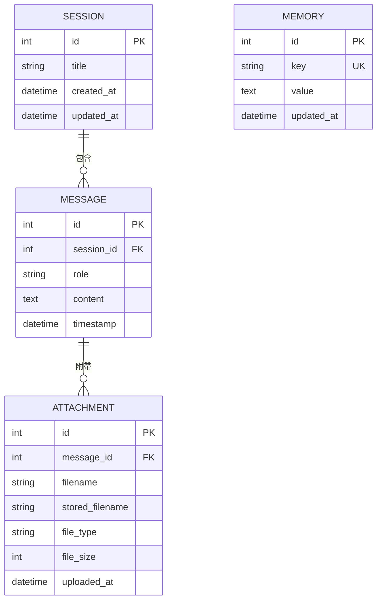

# 資料模型文件（Models Document）

### 1. 概述（Overview）
- **專案名稱**：智慧聊天機器人（Smart Chatbot）
- **版本**：1.0.0
- **日期**：2026-04-22
- **作者**：Antigravity
- **文件目的**：定義聊天機器人系統的所有資料實體、欄位規格、關聯關係與驗證規則
- **使用框架**：SQLAlchemy 2.0（ORM）+ Pydantic（API 資料驗證）

### 2. 資料庫選型（Database Selection）

| 項目 | 說明 |
|------|------|
| **資料庫類型** | 關聯式（SQL） |
| **資料庫引擎** | SQLite |
| **選擇原因** | 輕量級、零配置、單檔案部署，適合本機開發環境 |
| **版本** | SQLite 3.x（Python 內建） |

### 3. 資料實體定義（Data Entities）

#### 3.1 Session（聊天室）

- **描述**：代表一個聊天對話室，每個 Session 包含多則訊息
- **對應資料表名稱**：`sessions`

##### 欄位定義（Field Definitions）

| 欄位名稱 | 資料類型 | 必填 | 預設值 | 說明 |
|----------|----------|------|--------|------|
| id | Integer | 是 | 自動遞增 | 主鍵 |
| title | String(200) | 是 | "新對話" | 聊天室標題 |
| created_at | DateTime | 是 | 當前時間 | 建立時間 |
| updated_at | DateTime | 是 | 當前時間 | 最後更新時間（每次有新訊息時更新） |

##### 索引（Indexes）

| 索引名稱 | 欄位 | 類型 | 說明 |
|----------|------|------|------|
| ix_sessions_id | id | PRIMARY | 主鍵索引 |
| ix_sessions_updated | updated_at | INDEX | 排序用，依最後更新時間排序 |

##### 範例程式碼

```python
class Session(Base):
    __tablename__ = "sessions"
    id = Column(Integer, primary_key=True, index=True)
    title = Column(String(200), nullable=False, default="新對話")
    created_at = Column(DateTime, default=datetime.utcnow)
    updated_at = Column(DateTime, default=datetime.utcnow, onupdate=datetime.utcnow)

    messages = relationship("Message", back_populates="session", cascade="all, delete-orphan")
```

---

#### 3.2 Message（訊息）

- **描述**：代表聊天室中的一則訊息，包含角色、內容與時間戳記
- **對應資料表名稱**：`messages`

##### 欄位定義（Field Definitions）

| 欄位名稱 | 資料類型 | 必填 | 預設值 | 說明 |
|----------|----------|------|--------|------|
| id | Integer | 是 | 自動遞增 | 主鍵 |
| session_id | Integer | 是 | - | 外鍵，關聯至 sessions.id |
| role | String(20) | 是 | - | 訊息角色：`user` 或 `assistant` |
| content | Text | 是 | - | 訊息文字內容 |
| timestamp | DateTime | 是 | 當前時間 | 訊息發送時間 |

##### 索引（Indexes）

| 索引名稱 | 欄位 | 類型 | 說明 |
|----------|------|------|------|
| ix_messages_id | id | PRIMARY | 主鍵索引 |
| ix_messages_session | session_id | INDEX | 加速依聊天室查詢訊息 |
| ix_messages_timestamp | timestamp | INDEX | 依時間排序 |

##### 範例程式碼

```python
class Message(Base):
    __tablename__ = "messages"
    id = Column(Integer, primary_key=True, index=True)
    session_id = Column(Integer, ForeignKey("sessions.id"), nullable=False, index=True)
    role = Column(String(20), nullable=False)  # "user" 或 "assistant"
    content = Column(Text, nullable=False)
    timestamp = Column(DateTime, default=datetime.utcnow, index=True)

    session = relationship("Session", back_populates="messages")
    attachments = relationship("Attachment", back_populates="message", cascade="all, delete-orphan")
```

---

#### 3.3 Attachment（附件）

- **描述**：代表上傳至某則訊息的檔案附件（圖片或文件）
- **對應資料表名稱**：`attachments`

##### 欄位定義（Field Definitions）

| 欄位名稱 | 資料類型 | 必填 | 預設值 | 說明 |
|----------|----------|------|--------|------|
| id | Integer | 是 | 自動遞增 | 主鍵 |
| message_id | Integer | 是 | - | 外鍵，關聯至 messages.id |
| filename | String(255) | 是 | - | 原始檔案名稱 |
| stored_filename | String(255) | 是 | - | 儲存用檔案名稱（UUID 重新命名） |
| file_type | String(50) | 是 | - | 檔案 MIME 類型 |
| file_size | Integer | 是 | - | 檔案大小（bytes） |
| uploaded_at | DateTime | 是 | 當前時間 | 上傳時間 |

##### 索引（Indexes）

| 索引名稱 | 欄位 | 類型 | 說明 |
|----------|------|------|------|
| ix_attachments_id | id | PRIMARY | 主鍵索引 |
| ix_attachments_message | message_id | INDEX | 加速依訊息查詢附件 |

##### 範例程式碼

```python
class Attachment(Base):
    __tablename__ = "attachments"
    id = Column(Integer, primary_key=True, index=True)
    message_id = Column(Integer, ForeignKey("messages.id"), nullable=False, index=True)
    filename = Column(String(255), nullable=False)
    stored_filename = Column(String(255), nullable=False)
    file_type = Column(String(50), nullable=False)
    file_size = Column(Integer, nullable=False)
    uploaded_at = Column(DateTime, default=datetime.utcnow)

    message = relationship("Message", back_populates="attachments")
```

---

#### 3.4 Memory（記憶）

- **描述**：儲存使用者的偏好設定與跨對話持續性資訊
- **對應資料表名稱**：`memories`

##### 欄位定義（Field Definitions）

| 欄位名稱 | 資料類型 | 必填 | 預設值 | 說明 |
|----------|----------|------|--------|------|
| id | Integer | 是 | 自動遞增 | 主鍵 |
| key | String(100) | 是 | - | 記憶鍵名（如 "display_name"、"language"） |
| value | Text | 是 | - | 記憶值 |
| updated_at | DateTime | 是 | 當前時間 | 最後更新時間 |

##### 索引（Indexes）

| 索引名稱 | 欄位 | 類型 | 說明 |
|----------|------|------|------|
| ix_memories_id | id | PRIMARY | 主鍵索引 |
| ix_memories_key | key | UNIQUE | 鍵名唯一索引 |

##### 範例程式碼

```python
class Memory(Base):
    __tablename__ = "memories"
    id = Column(Integer, primary_key=True, index=True)
    key = Column(String(100), nullable=False, unique=True, index=True)
    value = Column(Text, nullable=False)
    updated_at = Column(DateTime, default=datetime.utcnow, onupdate=datetime.utcnow)
```

---

### 4. 關聯關係（Relationships）

| 來源實體 | 關聯類型 | 目標實體 | 外鍵欄位 | 說明 |
|----------|----------|----------|----------|------|
| Session | 一對多 | Message | messages.session_id | 一個聊天室包含多則訊息 |
| Message | 一對多 | Attachment | attachments.message_id | 一則訊息可包含多個附件 |

#### ER Diagram（實體關係圖）



### 5. 欄位驗證規則（Validation Rules）

| 實體 | 欄位名稱 | 驗證規則 | 錯誤訊息 |
|------|----------|----------|----------|
| Session | title | 必填，長度 1-200 字 | 聊天室標題不可為空且不超過 200 字 |
| Message | role | 必填，僅允許 "user" 或 "assistant" | 角色必須為 user 或 assistant |
| Message | content | 必填，長度 >= 1 | 訊息內容不可為空 |
| Attachment | file_type | 必填，白名單驗證 | 僅支援 jpg/png/gif/pdf/txt/docx 格式 |
| Attachment | file_size | 必填，<= 10MB | 檔案大小不可超過 10MB |
| Memory | key | 必填，唯一，長度 1-100 字 | 記憶鍵名不可重複 |

### 6. 資料序列化與轉換（Serialization & Transformation）

- **序列化格式**：JSON
- **序列化欄位**：所有欄位皆對外暴露
- **時間格式**：ISO 8601（`YYYY-MM-DDTHH:mm:ss`）
- **計算欄位**：
  - `Session.message_count`：該聊天室的訊息總數
  - `Session.last_message`：最後一則訊息的內容預覽（前 50 字）

### 7. 資料遷移策略（Migration Strategy）

- **遷移工具**：SQLAlchemy `Base.metadata.create_all()`（自動建立資料表）
- **版本控制**：首次執行自動建立，後續版本可改用 Alembic
- **資料填充（Seeding）**：首次啟動時自動建立預設記憶項目（display_name、language）
